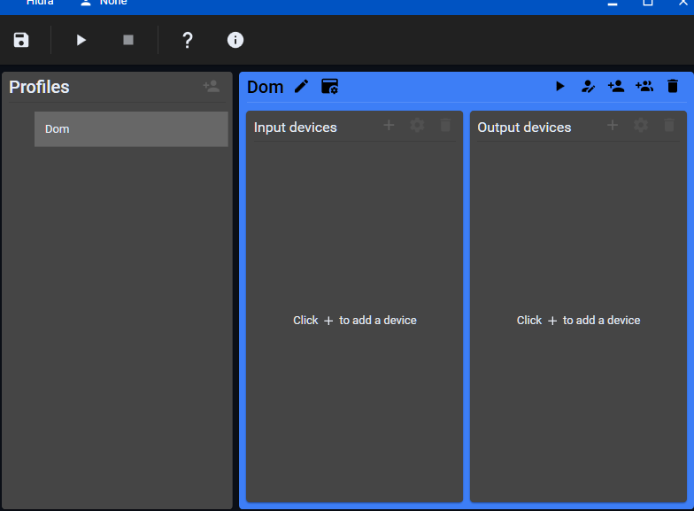
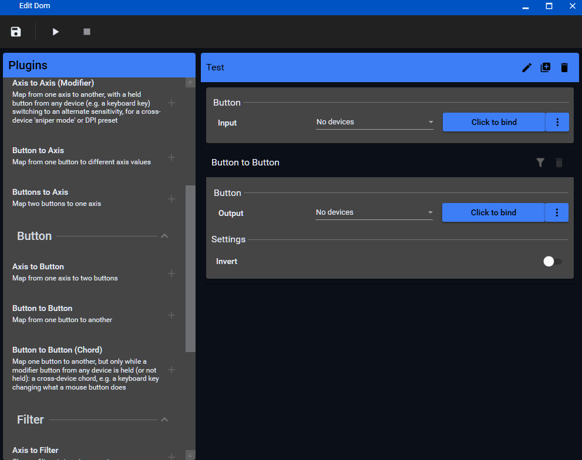

# Hidra

[](https://github.com/dayanez/Hidra/actions/workflows/build.yml)
[](https://github.com/dayanez/Hidra/releases)
[](LICENSE)

**Hidra remaps your keyboard and mouse, entirely in software.** Turn any key or button into a
different key, a mouse action, or a triggered command, no drivers, no reboot, works with any
keyboard or mouse regardless of manufacturer.

That's the whole idea: a background utility that intercepts input before it reaches Windows and
sends out whatever you told it to instead.

<p align="center">
  
  
</p>

## Why Hidra

Most remapping tools fall into one of two camps: OEM software tied to one brand of keyboard or
mouse, or general HID remappers that need a kernel driver to talk to game controllers. Hidra is
neither. It only does keyboard and mouse, on purpose, and that narrow scope is what lets it run
without installing anything at the driver level, on hardware from any manufacturer.

## DISCLAIMER
This Software will be flagged as malware. It is open source and you are free to inspect it as needed. The reason it's going to be flagged as malware is because this type of software could be used to make keyloggers and other offensive tools. I for the sake of safety will not be explaining and or elaborating how to do this. Refer to `SECURITY.md` as needed. 

## Features

- **Remap keys and mouse input** to other keys, mouse buttons, or mouse movement, with full
  analog control (sensitivity, dead zones) over mouse axes
- **Trigger actions from a button**: launch a program, open a URL, send a key chord, or run a
  system command (lock, volume, media keys), no output device needed
- **Cross-device combos**: hold a keyboard key as a modifier that changes what a mouse button
  does, or vice versa
- **Profiles**: nest them, and auto-switch between them based on which application is focused
- **Runs in the background**: closing the window keeps Hidra remapping from the system tray, with
  an optional "start with Windows" toggle
- **No kernel driver, ever**: input capture and output are both done in user space; nothing to
  install, nothing that needs a reboot
- **No injection**: doesn't hook into other processes, so it stays compatible with games that use
  anti-tampering technologies

## Getting started

Download the latest build from [Releases](https://github.com/dayanez/Hidra/releases): it's a
self-contained zip, no .NET runtime install required, just unzip and run `Hidra.exe`.

To build from source instead, you'll need the
[.NET 8 SDK](https://dotnet.microsoft.com/download/dotnet/8.0) (or Visual Studio 2022 17.8+ with
the ".NET desktop development" workload). There's nothing else to install.

```
dotnet build Hidra.sln
dotnet run --project Hidra\Hidra.csproj
```

## Current status

This is an active, in-progress fork, not a finished product yet. Working today:

- Driver-free keyboard and mouse capture and output, via a single provider (`Core_RawInputHook`)
- The full remapping engine, plugin system, and WPF UI described above

Out of scope, on purpose, not a gap to be filled: Hidra does not support game controllers,
gamepads, or joysticks, as input or output. The original project this forked from supported those,
along with MIDI, eye trackers, and other niche devices; all of that was removed rather than
ported, in favor of doing one thing (keyboard and mouse) well. It's still in git history if a
future fork wants it back; see `CHANGELOG.md`.

## How it's built

Hidra is a .NET 8 WPF app. The remapping engine lives in `Hidra.Core`, built-in remap plugins in
`Hidra.Plugins`, and device access in `Hidra.IOWrapper` (a vendored, heavily trimmed fork of
[IOWrapper](https://github.com/evilC/IOWrapper)). See `AGENTS.md` for the full directory
breakdown, and `SECURITY.md` for why input-capture code here gets held to a higher bar than a
typical utility.

## Contributing

Bug reports, feature requests, and pull requests are welcome; see `CONTRIBUTING.md` for commit
conventions. If you're touching anything that captures raw input or emits synthetic input, read
`SECURITY.md` first. Community conduct is covered by `CODE_OF_CONDUCT.md`.

## Attribution and license

Hidra is open source under the [MIT license](LICENSE); see the LICENSE file for the original
copyright notice, which this fork retains as required.
